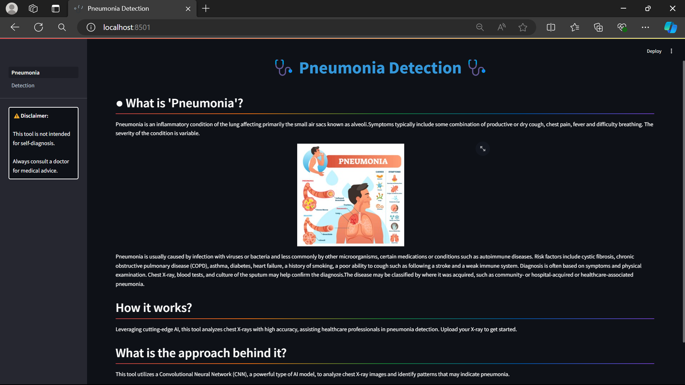
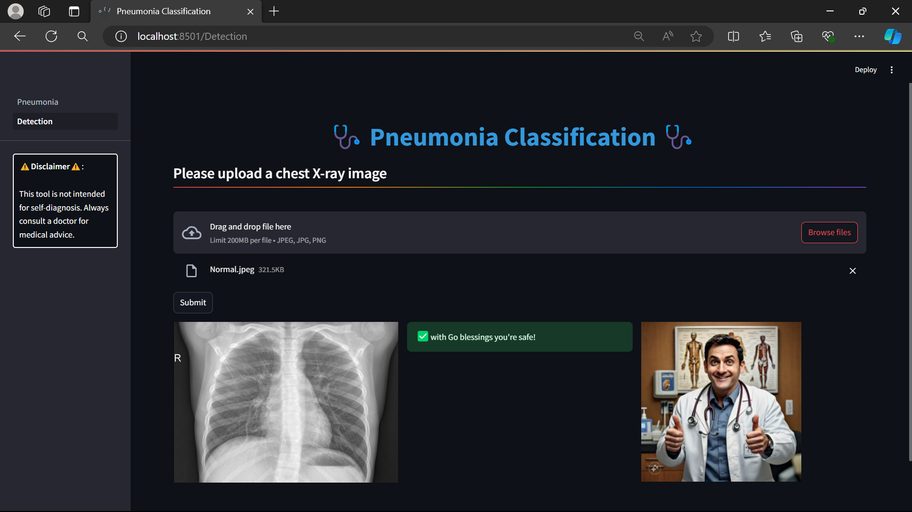
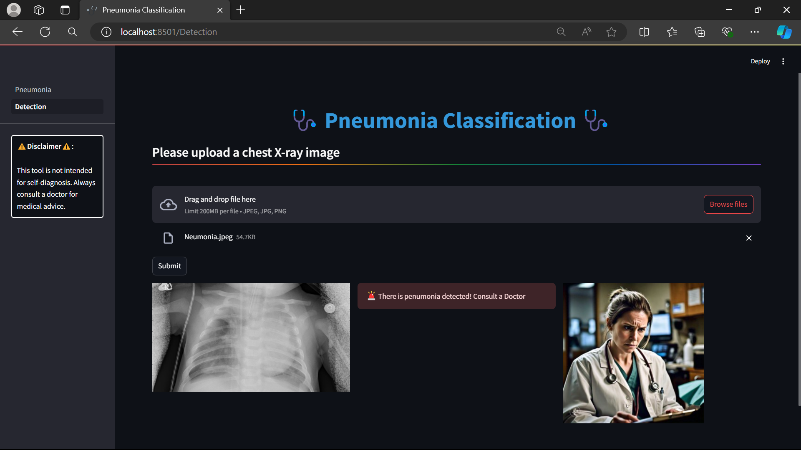

## Pneumonia Detection
What is **Pneumonia**?
-> Pneumonia is an inflammatory condition of the lung affecting primarily the small air sacs known as alveoli.Symptoms typically include some combination of productive or dry cough, chest pain, fever and difficulty breathing. The severity of the condition is variable.

<details open="open">
  <summary>Table of Contents</summary>
  <ol>
    <li>
      <a href="#Approach">Approach</a>
    </li>
    <li>
      <a href="#Features">Features</a>
    </li>
    <li>
      <a href="#Technologies">Technologies</a>
    </li>
    <li>
      <a href="#Prototype">Protoype</a>
    </li>
    <li>
	    <a href = "#How-to-Start-Project">How to Start Project</a>
    </li>
    <li>
	    <a href = "#Contact-Us">Contact Us</a>
    </li>
    <li>
	    <a href = "#License">License</a>
    </li>
  </ol>
</details>

## Approach
- This tool utilizes a Convolutional Neural Network (CNN), a powerful type of AI model, to analyze chest X-ray images and identify patterns that may indicate pneumonia.


## Features
- Leveraging cutting-edge AI, this tool analyzes chest X-rays with high accuracy, assisting healthcare professionals in pneumonia detection. Upload your X-ray to get started.
## Technologies
- Python
- Streamlit
- Tensorflow
- keras

## Prototype:

<div style="display:flex; flex-wrap:wrap; gap:2%; justify-content:center;">



</div>

## How to Start Project

Follow these steps to get started with the project:

1. **Clone the Repository:**
   ```bash
   git clone <repository_link>
   ```
2. **Install Anaconda:**
   
   Make sure you have Anaconda installed on your system. If not, you can download and install it from the official website: https://www.anaconda.com/download/
   
4. **Create a Virtual Environment:**
   
   Create a new virtual environment using Python 3.8:

   ```bash
   conda create --name your_env_name python=3.8 -y
   ```
   Replace your_env_name with the desired name for your virtual environment.
   
   Activate the newly created environment:
   ```bash
   conda activate your_env_name
   ```
5. **Install Dependencies:**
   
   Install the project dependencies by running:
   ```bash
   pip install -r requirements.txt
   ```
   This command will install all the required packages listed in the requirements.txt file.

7. **Run the Streamlit App:**
   ```bash
   streamlit run Pneumonia.py
   ```
   This command will start the Streamlit app.

## Contact Us

To learn more about, please reach out:

📧 suzalkachhadiya111@gmail.com

## License

This project is licensed under the MIT License - see the [LICENSE](LICENSE) file for details.